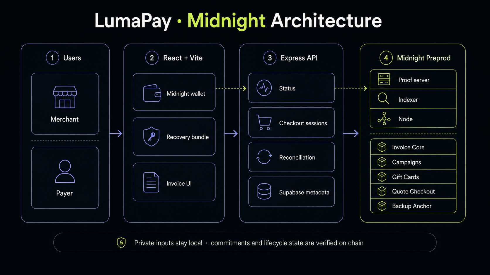
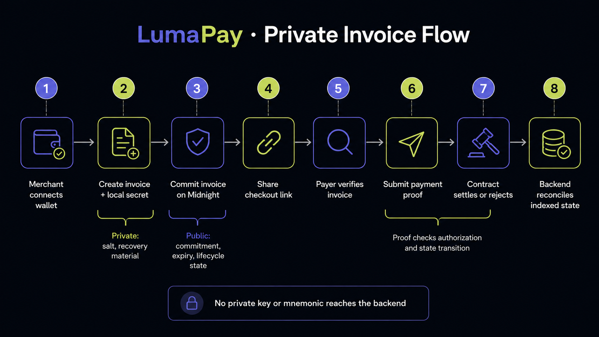

# Architecture

The React/Vite client discovers a compatible Midnight wallet, keeps private invoice material locally, generates proofs through the configured proof provider, and submits authorized transactions. The Express API exposes deployment health, direct indexed-state reads, checkout metadata, and reconciliation. Supabase is optional for health and chain reads and required only for database-backed product routes.

The Midnight Preprod deployment is split into five modules so each circuit set stays within practical deployment and block-resource boundaries. The indexer is the backend's read source; the node receives submitted transactions; the proof server produces zero-knowledge proofs.

## Data ownership

| Data | Owner | Storage |
| --- | --- | --- |
| Wallet credentials | User wallet | Wallet only |
| Invoice opening and claim secret | Merchant | Downloaded local recovery bundle |
| Commitments and lifecycle | Contract | Midnight ledger |
| Checkout metadata | Application | Supabase when configured |
| Reconciliation cache | Application | Supabase when configured |

