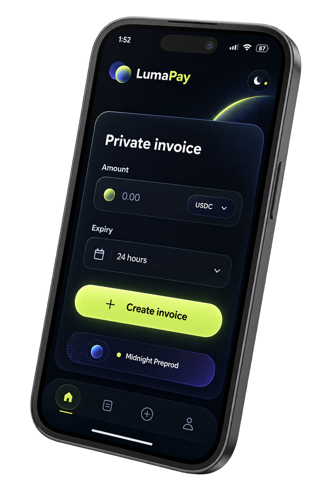

# Frontend

The frontend is the preserved LumaPay React/Vite desktop and mobile interface, migrated to Midnight-native boundaries.

## Product surfaces

- Landing, privacy, vision, explorer, docs, support, settings, and responsive shell.
- Merchant invoice creation, dashboard, invoice detail, receipt history, audit export, QR, and hosted checkout.
- Campaign/donation profile links and contribution tracking.
- Gift-card create, share, redeem, and history screens.
- Card wallet profile UI with local PIN/encrypted mirror state and NIGHT-only Preprod limits.
- Privacy-wallet controls with native-safe backup/sweep boundaries.
- BatchPay validation and wallet-approved NIGHT settlement flow.
- Developer API, SDK, MCP, and integration documentation.
- Telegram handoff UI without server-side user signing.

## Wallet boundary

Wallet discovery uses the Midnight DApp Connector API 4.x through `window.midnight`.

The frontend may:

- request public and shielded wallet addresses;
- request wallet signatures for backend authentication;
- submit wallet-approved Midnight transactions;
- read local transaction history exposed by the connector.

The frontend must not:

- collect mnemonics, seeds, raw private keys, or recovery phrases;
- emulate wallet approval;
- claim a card/private-wallet spend succeeded when a native Midnight spend authority is unavailable;
- expose inactive Preprod token choices.

## Active Preprod token model

The live Preprod UI exposes NIGHT settlement only. Quote conversion and historical multi-token schemas remain contract/data-model concepts, but stablecoin payment choices are not shown as active Preprod features.

## Contract artifacts

Before building, generated contract artifacts are copied into `frontend/public/zk`:

```powershell
npm run prepare:zk
```

Contract addresses can be overridden with the variables documented in `frontend/.env.example`.

## Verification

```powershell
npm run check:legacy
npm run build
npm run test:ui
```

`check:legacy` guards shipped frontend source against removed former-chain execution paths. `build` type-checks the full React app and creates the production bundle. `test:ui` exercises the responsive wallet connection surface against the local preview.


